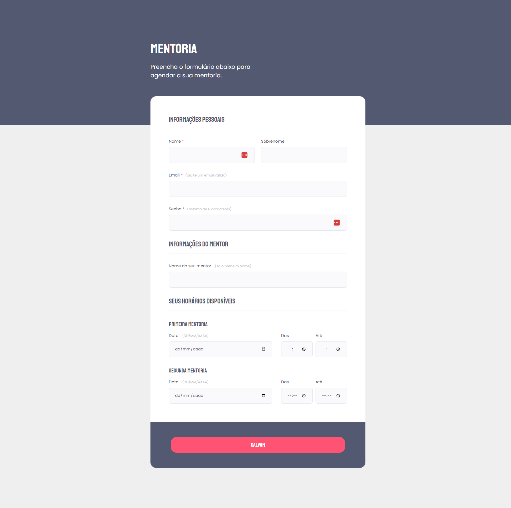

# Explorer - Stage 03

> Creating Forms

- This was a challenge project to create forms in HTML & CSS.
- The form is for mentorship registration, where the user may schedule and choose their preferred mentor.
- The layout was based on a Figma project provided by Rocketseat.

- [Click to view it live!](https://jessicaranft.github.io/explorer-desafio-form01/)

## Features

`HTML` `CSS`

## Software

- VSCode
